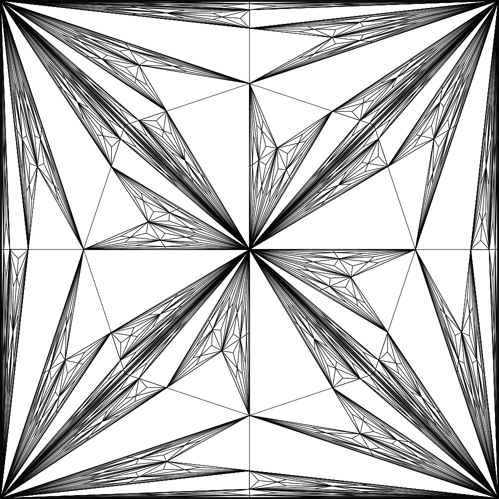

# PolygonArt / TriangleArt

Random vector-art generator based on splitting polygons/triangles into
sub-triangles. Written in Haskell λ.

It works by repeatedly connecting a pair of outer nodes of a polygon
with its center, such that a triangle is created. The process is
then recursively applied to the set of constructed polygons.

This started as a toy project and serves now as a training ground to
improve my Haskell skills.

## Next milestones
* extend comments to haddock documentation
* add tests
* add random color
* integrate into a web service
