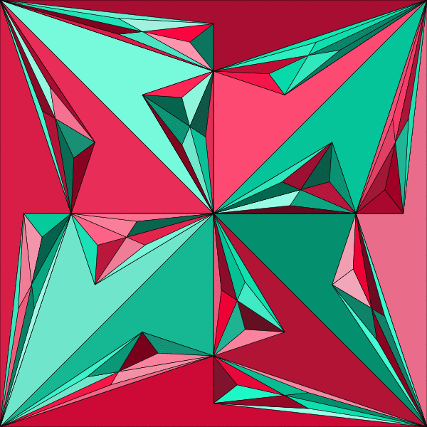

# PolygonArt / TriangleArt



Random vector-art generator based on splitting polygons/triangles into
sub-triangles. Written in Haskell λ.

It works by repeatedly connecting a pair of outer nodes of a polygon
with its center, such that a triangle is created. The process is
then recursively applied to the set of constructed polygons.

This started as a toy project and serves now as a training ground to
improve my Haskell skills.

## Table of Contents
* [TL;DR](#tldr)
* [Prerequisites](#prerequisites)
  * [Installation](#installation)
* [Building](#building)
* [Testing](#testing)
* [Usage](#usage)
* [Documentation](#documentation-haddock)
* [Next milestones](#next-milestones)

## TL;DR
```console
git clone https://github.com/ahaubner/PolygonArt.git
cd PolygonArt
stack build
stack exec polygon 12 > output.svg && xdg-open output.svg
```

*Doesn't work?* You **need [stack](#prerequisites)**!

## Prerequisites
You'll need the Haskell development tool [stack](https://haskellstack.org).

### Installation
Follow the official [installation guide](https://docs.haskellstack.org/en/stable/install_and_upgrade/) of stack.
If you're using Arch Linux, the following command should do:

```console
pacman -S stack
```

## Building
```console
stack build
```

## Testing
```console
stack test
```

## Usage
You can run it with an arbitrary integer as seed for the random number generator:
```console
stack exec polygon <seed>
```

It will output the image in SVG format.
Here's a complete example for generating and displaying an image on a graphical Linux installation:

```console
stack exec polygon 1337 > output.svg && xdg-open output.svg
```

## Documentation (Haddock)
```console
stack haddock
```

## Next milestones
* integrate into a web service
* add more tests
